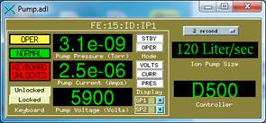
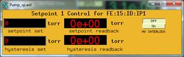
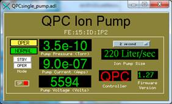
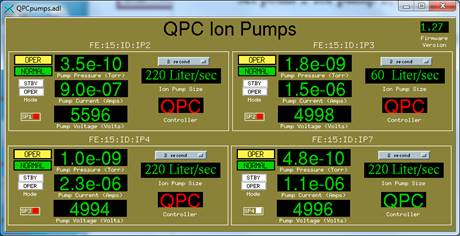

# Ion Pump Controllers

The vac module supports several ion pump controller models through the [`digitel` record type](digitelRecord) and the `devDigitelPump` ASYN device support driver. Each `digitelPump.db` instance creates a single `digitel` record that handles pressure, voltage, current, operating mode, setpoints, bakeout, and pump identification for one pump.

For the QPC, alternative databases using [streamDevice and Modbus](qpc) are also available.

## Supported Models

### Digitel 500/1500

- **Manufacturer:** Physical Electronics (Perkin-Elmer)
- **Communication:** RS-232 only
- **Serial settings:** 9600 baud, 7 data bits, even parity, 1 stop bit
- **Input EOS:** `\n\r` -- Output EOS: `\r`
- **DEV value:** `D500` or `D1500`
- **ADDR:** 0 (not used)
- **STN:** Setpoint number (0--3)

The Digitel 500 and 1500 are single-pump controllers. STN selects the setpoint number to read back rather than a pump number.

### MPC/MPC-II

- **Manufacturer:** Gamma Vacuum (formerly Gamma One)
- **Communication:** RS-232 and RS-485
- **Serial settings:** 9600 baud, 8 data bits, no parity, 1 stop bit
- **Input EOS:** `\r` -- Output EOS: `\r`
- **DEV value:** `MPC`
- **ADDR:** Device address (0--255, must match hardware setting)
- **STN:** Pump number (1 or 2)

The MPC supports two pumps per controller. Each pump has its own setpoints: pump 1 uses odd-numbered setpoints, pump 2 uses even-numbered setpoints.

The LPC uses the same protocol and can be configured with `DEV=MPC`.

**Firmware notes:**
- MPC-II firmware 3.6 reports setpoint status inverted over the serial port.
- Recommended firmware versions are 3.45 or 3.61.

### QPC/QPCe

- **Manufacturer:** Gamma Vacuum
- **Communication:** RS-232, RS-485, and Ethernet (QPCe)
- **Serial settings:** 9600 baud, 8 data bits, no parity, 1 stop bit
- **Input EOS:** `\r` -- Output EOS: `\r`
- **DEV value:** `QPC`
- **ADDR:** Device address (0--255, must match hardware setting)
- **STN:** Pump number (1--4)

The QPC is a quad pump controller. The driver associates each pump number with the same-numbered setpoint (pump 1 uses setpoint 1, pump 2 uses setpoint 2, etc.). Load one `digitelPump.db` instance per pump.

The QPC can also be controlled through [streamDevice or Modbus databases](qpc) which use standard EPICS record types.

**Firmware notes:**
- Tested on firmware versions 1.27, 1.30, and 1.35.
- Command 3B (combined setpoint read/write) reads correctly but does not set properly. The driver uses commands 3C and 3D instead.

### SPCe

- **Manufacturer:** Gamma Vacuum
- **Communication:** RS-232, RS-485, Ethernet
- **DEV value:** `QPC` (use the QPC device type)

The SPCe is a single pump controller that uses the same protocol as the QPC. Set `DEV=QPC` in the database substitutions. Do not use `DEV=MPC`, as the MPC driver requests multiple setpoints which causes errors with the SPCe.

## Database: digitelPump.db

Each instance of `digitelPump.db` creates one `digitel` record for a single pump. The record name is `$(P)$(PUMP)`.

### Macro Reference

| Macro | Description | Values |
|-------|-------------|--------|
| `P` | PV prefix | Any valid PV prefix (e.g. `SR:`) |
| `PUMP` | PV suffix identifying the pump | e.g. `IP1`, `IP2` |
| `PORT` | ASYN port name | First argument from `drvAsynSerialPortConfigure` or `drvAsynIPPortConfigure` |
| `ADDR` | Device address | `0` for Digitel 500/1500; hardware address for MPC/QPC |
| `DEV` | Device type | `D500`, `D1500`, `MPC`, or `QPC` |
| `STN` | Station number | Setpoint number (0--3) for D500/D1500; pump number (1--2) for MPC; pump number (1--4) for QPC |

### Example: Using iocsh Scripts (Recommended)

The [iocsh scripts](iocsh-scripts) handle serial port configuration and database loading automatically:

```
# MPC pump 1 on a serial port
iocshLoad("$(VAC)/iocsh/digitelPump.iocsh", "PREFIX=SR:, INSTANCE=IP1, PORT=/dev/ttyUSB0, DEV=MPC, STN=1, ADDR=5")

# MPC pump 2 on the same serial port
iocshLoad("$(VAC)/iocsh/digitelPump.iocsh", "PREFIX=SR:, INSTANCE=IP2, PORT=/dev/ttyUSB0, DEV=MPC, STN=2, ADDR=5")

# Digitel 500
iocshLoad("$(VAC)/iocsh/digitelPump.iocsh", "PREFIX=SR:, INSTANCE=IP3, PORT=/dev/ttyUSB1, DEV=D500, STN=2")
```

### Example: Manual st.cmd Configuration

For manual configuration, set up the ASYN port and load the database directly:

```
# QPC via Ethernet using a Moxa terminal server (port 4002)
drvAsynIPPortConfigure("IP1_4", "10.6.33.133:4002", 0, 0, 0)
asynOctetSetInputEos("IP1_4", -1, "\r")
asynOctetSetOutputEos("IP1_4", -1, "\r")

dbLoadRecords("db/digitelPump.db", "P=FE:28:ID:,PUMP=IP1,PORT=IP1_4,ADDR=5,DEV=QPC,STN=1")
dbLoadRecords("db/digitelPump.db", "P=FE:28:ID:,PUMP=IP2,PORT=IP1_4,ADDR=5,DEV=QPC,STN=2")
dbLoadRecords("db/digitelPump.db", "P=FE:28:ID:,PUMP=IP3,PORT=IP1_4,ADDR=5,DEV=QPC,STN=3")
dbLoadRecords("db/digitelPump.db", "P=FE:28:ID:,PUMP=IP4,PORT=IP1_4,ADDR=5,DEV=QPC,STN=4")
```

```
# Digitel 500 on a local serial port
drvAsynSerialPortConfigure("serial5", "/dev/ttyUSB0", 0, 0, 0)
asynSetOption("serial5", -1, "baud", "9600")
asynSetOption("serial5", -1, "bits", "7")
asynSetOption("serial5", -1, "parity", "even")
asynSetOption("serial5", -1, "stop", "1")
asynOctetSetInputEos("serial5", -1, "\n\r")
asynOctetSetOutputEos("serial5", -1, "\r")

dbLoadRecords("db/digitelPump.db", "P=MR:,PUMP=IP1,PORT=serial5,ADDR=0,DEV=D500,STN=2")
```

```
# MPC on RS-485
drvAsynSerialPortConfigure("serial6", "/dev/ttyUSB1", 0, 0, 0)
asynSetOption("serial6", -1, "baud", "9600")
asynSetOption("serial6", -1, "bits", "8")
asynSetOption("serial6", -1, "parity", "none")
asynSetOption("serial6", -1, "stop", "1")
asynOctetSetInputEos("serial6", -1, "\r")
asynOctetSetOutputEos("serial6", -1, "\r")

dbLoadRecords("db/digitelPump.db", "P=MR:,PUMP=IP2,PORT=serial6,ADDR=5,DEV=MPC,STN=1")
dbLoadRecords("db/digitelPump.db", "P=MR:,PUMP=IP3,PORT=serial6,ADDR=5,DEV=MPC,STN=2")
```

## GUI Displays

Display files are provided in MEDM (.adl), caQtDM (.ui), CSS-BOY (.opi), EDM (.edl), and Phoebus (.bob) formats.

### Pump.adl / Pump_sp.adl

Main display and setpoint display for Digitel 500/1500, MPC, and MPC-II controllers. Can also be used with the QPC, though the keyboard lock and display mode buttons will not function (keyboard lock would disable RS-232 communications on the QPC).





It is not recommended to set the setpoints remotely. The appropriate personnel should set setpoints locally on the device.

```
medm -x -macro "P=FE:15:ID:,PUMP=IP1" Pump.adl
```

### QPCsingle_pump.adl / QPCpumps.adl

Displays designed specifically for the QPC. The single pump display shows one pump, while the multi-pump display shows all four.



The setpoint indicator must be configured so that setpoint N corresponds to pump N.

```
medm -x -macro "P=FE:15:ID:IP,PUMP1=2" QPCsingle_pump.adl
```



```
medm -x -macro "P=FE:15:ID:IP,PUMP1=2,PUMP2=3,PUMP3=4,PUMP4=7" QPCpumps.adl
```

## Serial Settings Summary

| Device | Baud | Data Bits | Parity | Stop Bits | Input EOS | Output EOS |
|--------|------|-----------|--------|-----------|-----------|------------|
| D500 / D1500 | 9600 | 7 | Even | 1 | `\n\r` | `\r` |
| MPC / MPC-II | 9600 | 8 | None | 1 | `\r` | `\r` |
| QPC / QPCe | 9600 | 8 | None | 1 | `\r` | `\r` |
