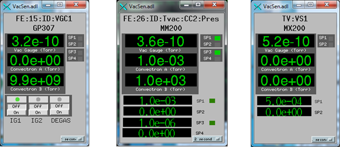

# Vacuum Gauge Controllers
{: .no_toc}

## Table of contents
{: .no_toc .text-delta }

- TOC
{:toc}

The vac module supports several vacuum gauge controller models through the [`vs` record type](vsRecord) and the `devVacSen` ASYN device support driver. Each `vs.db` instance creates a single `vs` record that handles ion gauge pressures, convectron gauge pressures, setpoint status, ion gauge on/off control, and degas control.

## Supported Models

### GP307

- **Manufacturer:** Granville-Phillips
- **Communication:** RS-232 only
- **Serial settings:** 9600 baud, 7 data bits, even parity, 1 stop bit
- **Input EOS:** `\r\n` -- Output EOS: `\r\n`
- **DEV value:** `GP307`
- **ADDR:** 0
- **STN:** Not used (set to 0)

The GP307 supports two ion gauges, two convectron gauges, degas control, and six setpoints.

### GP350

- **Manufacturer:** Granville-Phillips
- **Communication:** RS-232 and RS-485
- **Serial settings:** 9600 baud, 8 data bits, no parity, 1 stop bit
- **Input EOS:** `\r` -- Output EOS: `\r`
- **DEV value:** `GP350`
- **ADDR:** 0 for RS-232; 1--31 for RS-485 (two-digit form, e.g. `01`)
- **STN:** Not used (set to 0)

The GP350 supports two ion gauges, two convectron gauges, degas control, and six setpoints.

### MM200

- **Manufacturer:** Televac
- **Communication:** RS-232
- **Serial settings:** 9600 baud, 8 data bits, no parity, 1 stop bit
- **Input EOS:** `\r` -- Output EOS: `\r`
- **DEV value:** `MM200`
- **ADDR:** 0 for RS-232; 0--59 for RS-485 (encoded as `0-9`, `A-Z`, `a-z`)
- **STN:** Cold cathode station number (see below)

The MM200 has two cold cathode gauges and a minimum of two convectron gauges. The STN value determines which cold cathode gauge and convectron gauges are read:

| STN | Cold Cathode | Convectron 1 | Convectron 2 |
|-----|-------------|--------------|--------------|
| 3 | 3 | 1 | (none) |
| 4 | 4 | 2 | (none) |
| 5 | 5 | 1 | 3 |
| 6 | 6 | 2 | 4 |

Alternatively, you can specify all four parameters directly by providing them space-separated in the STN macro: `STN=<CC> <CV1> <CV2> <SPT>`. When more than one value is given, all four are required.

{: .warning }
> Firmware version 2.34 reboots the processor periodically during communications.
> Version 2.13 is the stable release.

### MX200

- **Manufacturer:** Televac
- **Communication:** RS-232 and RS-485
- **Serial settings:** 8 data bits, no parity, 1 stop bit, no handshaking
- **Baud rate:** Configurable from 9600 to 115200; factory default is **115200**
- **Input EOS:** `\r` -- Output EOS: `\r`
- **DEV value:** `MX200`
- **ADDR:** 0 for RS-232; 0--99 for RS-485 (two-digit decimal)
- **STN:** Cold cathode station number (same usage as MM200)

The MX200 is the newer Televac model and does not have the firmware reboot issue present in the MM200. STN usage is the same as for the MM200.

{: .important }
> The MX200 factory default baud rate is 115200. The iocsh script defaults to 9600 for consistency with other devices in this module. Either change the device to 9600 or pass `BAUD=115200` to the iocsh script.

### CC10

- **Manufacturer:** Televac
- **Communication:** RS-232 and RS-485
- **Serial settings:** 9600 baud, 8 data bits, no parity, 1 stop bit
- **Input EOS:** `\r` -- Output EOS: `\r`
- **DEV value:** `CC10`
- **ADDR:** 0 for RS-232; 0x0--0xF for RS-485 (hex)
- **STN:** Not used (set to 0)

The CC10 integrates a diode and cold cathode gauge into a single unit. It has three setpoints that are read by the driver. The RS-485 address prefix uses the STX character (hex 02).

## Database: vs.db

Each instance of `vs.db` creates one `vs` record for a single vacuum gauge controller. The record name is `$(P)$(GAUGE)`.

### Macro Reference

| Macro | Description | Values |
|-------|-------------|--------|
| `P` | PV prefix | Any valid PV prefix (e.g. `SR:`) |
| `GAUGE` | PV suffix identifying the gauge | e.g. `VS1`, `VGC1` |
| `PORT` | ASYN port name | First argument from `drvAsynSerialPortConfigure` or `drvAsynIPPortConfigure` |
| `ADDR` | Device address | `0` for RS-232; positive number for RS-485 (format varies by device) |
| `DEV` | Device type | `GP307`, `GP350`, `MM200`, `MX200`, or `CC10` |
| `STN` | Station number | Cold cathode station for MM200/MX200; `0` for GP307, GP350, CC10 |

### Example: Using iocsh Scripts (Recommended)

The [iocsh scripts](iocsh-scripts) handle serial port configuration and database loading automatically:

```
# GP350 on a serial port
iocshLoad("$(VAC)/iocsh/vacSensor.iocsh", "PREFIX=SR:, INSTANCE=VS1, PORT=/dev/ttyUSB0, DEV=GP350")

# MM200 cold cathode station 5
iocshLoad("$(VAC)/iocsh/vacSensor.iocsh", "PREFIX=SR:, INSTANCE=VS2, PORT=/dev/ttyUSB1, DEV=MM200, STN=5")

# CC10 on RS-485
iocshLoad("$(VAC)/iocsh/vacSensor.iocsh", "PREFIX=SR:, INSTANCE=VS3, PORT=/dev/ttyUSB2, DEV=CC10, STN=0, ADDR=1")

# MX200 at 9600 baud (device must be configured to match)
iocshLoad("$(VAC)/iocsh/vacSensor.iocsh", "PREFIX=SR:, INSTANCE=VS4, PORT=/dev/ttyUSB3, DEV=MX200, STN=3")

# MX200 at factory default baud rate
iocshLoad("$(VAC)/iocsh/vacSensor.iocsh", "PREFIX=SR:, INSTANCE=VS4, PORT=/dev/ttyUSB3, DEV=MX200, STN=3, BAUD=115200")
```

### Example: Manual st.cmd Configuration

For manual configuration, set up the ASYN port and load the database directly:

```
# GP307 (note: 7 data bits, even parity, \r\n end-of-string)
drvAsynSerialPortConfigure("serial1", "/dev/ttyUSB0", 0, 0, 0)
asynSetOption("serial1", -1, "baud", "9600")
asynSetOption("serial1", -1, "bits", "7")
asynSetOption("serial1", -1, "parity", "even")
asynSetOption("serial1", -1, "stop", "1")
asynOctetSetInputEos("serial1", -1, "\r\n")
asynOctetSetOutputEos("serial1", -1, "\r\n")

dbLoadRecords("db/vs.db", "P=MR:,GAUGE=VS1,PORT=serial1,ADDR=0,DEV=GP307,STN=0")
```

```
# GP350 (8 data bits, no parity)
drvAsynSerialPortConfigure("serial2", "/dev/ttyUSB1", 0, 0, 0)
asynSetOption("serial2", -1, "baud", "9600")
asynSetOption("serial2", -1, "bits", "8")
asynSetOption("serial2", -1, "parity", "none")
asynSetOption("serial2", -1, "stop", "1")
asynOctetSetInputEos("serial2", -1, "\r")
asynOctetSetOutputEos("serial2", -1, "\r")

dbLoadRecords("db/vs.db", "P=MR:,GAUGE=VS2,PORT=serial2,ADDR=0,DEV=GP350,STN=0")
```

```
# Two MM200 cold cathodes on the same port
drvAsynSerialPortConfigure("serial3", "/dev/ttyUSB2", 0, 0, 0)
asynSetOption("serial3", -1, "baud", "9600")
asynSetOption("serial3", -1, "bits", "8")
asynSetOption("serial3", -1, "parity", "none")
asynSetOption("serial3", -1, "stop", "1")
asynOctetSetInputEos("serial3", -1, "\r")
asynOctetSetOutputEos("serial3", -1, "\r")

dbLoadRecords("db/vs.db", "P=MR:,GAUGE=VS3,PORT=serial3,ADDR=0,DEV=MM200,STN=3")
dbLoadRecords("db/vs.db", "P=MR:,GAUGE=VS4,PORT=serial3,ADDR=0,DEV=MM200,STN=4")
```

```
# MM200 with explicit station specification (CC CV1 CV2 SPT)
dbLoadRecords("db/vs.db", "P=MR:,GAUGE=VS3,PORT=serial3,ADDR=0,DEV=MM200,STN=3 1 0 1")
dbLoadRecords("db/vs.db", "P=MR:,GAUGE=VS4,PORT=serial3,ADDR=0,DEV=MM200,STN=5 1 0 2")
```

```
# CC10 on RS-485
drvAsynSerialPortConfigure("serial4", "/dev/ttyUSB3", 0, 0, 0)
asynSetOption("serial4", -1, "baud", "9600")
asynSetOption("serial4", -1, "bits", "8")
asynSetOption("serial4", -1, "parity", "none")
asynSetOption("serial4", -1, "stop", "1")
asynOctetSetInputEos("serial4", -1, "\r")
asynOctetSetOutputEos("serial4", -1, "\r")

dbLoadRecords("db/vs.db", "P=MR:,GAUGE=VS5,PORT=serial4,ADDR=1,DEV=CC10,STN=0")
```

## GUI Displays

Display files are provided in MEDM (.adl), caQtDM (.ui), CSS-BOY (.opi), EDM (.edl), and Phoebus (.bob) formats.

### VacSen.adl

A single display used for all vacuum gauge controller types. The display adapts to the controller type and shows ion gauge pressure, convectron gauge pressures, setpoint status, and control buttons.



```
medm -x -macro "P=FE:15:ID:,GAUGE=VGC1" VacSen.adl
medm -x -macro "P=FE:26:ID:Tvac:,GAUGE=CC2:Pres" VacSen.adl
medm -x -macro "P=TV:,GAUGE=VS1" VacSen.adl
```

## Serial Settings Summary

| Device | Baud | Data Bits | Parity | Stop Bits | Input EOS | Output EOS |
|--------|------|-----------|--------|-----------|-----------|------------|
| GP307 | 9600 | 7 | Even | 1 | `\r\n` | `\r\n` |
| GP350 | 9600 | 8 | None | 1 | `\r` | `\r` |
| MM200 | 9600 | 8 | None | 1 | `\r` | `\r` |
| MX200 | 9600--115200* | 8 | None | 1 | `\r` | `\r` |
| CC10 | 9600 | 8 | None | 1 | `\r` | `\r` |

\* The MX200 factory default baud rate is 115200. The baud rate is configurable on the device. The iocsh script defaults to 9600.
