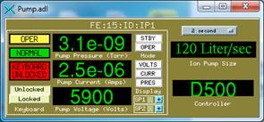
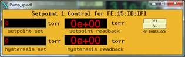
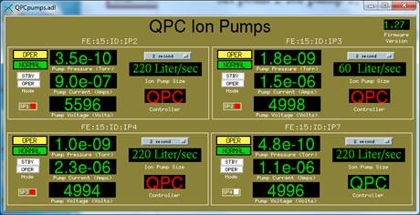

# The synApps vac module

The synApps vac module provides the EPICS databases, device drivers, and
records for the following equipment:

## Ion Pump Controllers

* Digitel 500/1500 - Physical Electronics (Single Pump Controller)
* MPC and MPC-II - Gamma Vacuum (Multiple Pump Controller)
* QPC - Gamma Vacuum (Quad Pump Controller) _Added June 2018_
* SPCe - Gamma vacuum (Single Pump Controller)
* Although not specifically tested I suspect that this support module will also work with the MPCq


## Vacuum Gauge Controllers

* MM200 and MX200 - Televac
* GP307 and GP350 - Granville Phillips

Support for the Spectra VacScan and Satellite RGA's has been discontinued since EPICS 3.14.
Support for these devices was available in EPICS 3.13 using MPF and has not been converted to ASYN.


## Things to note

1. MPC-II firmware 3.6 does not report the set point status properly from the serial port, they are inverted.

   a. Versions 3.45 or 3.6 are the stable releases.

2. The Televac firmware version 2.34 reboots the processor periodically during communications.

   a. Version 2.13 is the stable release. This is not an issue for the newer MX200 model.

3. New Gamma Vacuum command 3B for setting and read back of set points has an issue as of firmware 1.35 (at least for the QPC).

   a. Read-back for command 3B is ok but setting the set points does not work properly. Instead use the 3C and 3D commands which this driver already does.

4. QPC streamDevice and Modbus support files have now been added to this module.

   a. Modbus database only has 1 of the pumps in it and currently the read-back status is not working.

   b. streamDevice proto files are available for Ethernet and serial port.

   c. This database supports a single pump on the controller.

   d. Only set points that match the pump number have been tested (one per pump).

5. When using the digitelRecord for the SPC device

   a. Set the device type in the st.cmd file to QPC because the driver was written to use 1 set point per pump.

   b. Setting this to MPC causes an error when asking for set points since the MPC portion of the driver asks for multiple set points.


## Required Modules

vac requires ASYN to build.
Building the internal test IOC is disabled in `vacApp/src/Makefile`.
When the IOC is built for vxWorks it assumes the use of IPAC for the tyGSOctal serial interface, but any ASYN-compatible serial device should work.
IOCs using the streamDevice or modbus databases will obviously need those modules to be built in.

## Software Published

The vac module publishes the following software items for use by ioc applications:

### Record Types

The digitelRecord supports the Digitel Ion Pump controllers.

The vsRecord supports the Vacuum Guage controllers.

* Currently there is no documentation for these record types.

* streamDevice and Modbus databases each contain 27 standard EPICS records per pump

## Databases

Databases included are digitelPump.db and vs.db which provide a single record instance for one device.

The following are required substitutions for each database:

### digitelPump.db

```
P = <PV Prefix>
PUMP = <PV Suffix (usually pump number)>
PORT = Asyn port name (first argument from drvAsynPortConfigure)
ADDR = 5 for MPC but must match the device address
       0 for D500 and D1500

DEV = which device the record will talk to from the following list:
      D500 - Digitel 500
      D1500 - Digitel 1500
      MPC - MPC and MPC-II
      QPC - QPC and QPCe (Ethernet option has not been tested)

STN = Pump number for MPC and QPC
      Set point number for D500/D1500
```

This driver assumes for a QPC (four pumps) that the set points will be set to the same as the pump number.
Therefore, QPC pump 1 is associated with the set point 1 read back, etc.


### vs.db

```
P = <PV Prefix>
GAUGE = <PV Suffix (usually vacuum gauge number)>
PORT = Asyn port name (first argument from drvAsynPortConfigure)
ADDR = 0
DEV = MM200 or MX200
STN = Gauge cold cathode station number
```

## GUI display files

Displays included are Pump.adl, Pump_sp.adl, QPCpumps.adl, QPCsingle_pump.adl,
and VacSen.adl.


### Pump.adl and Pump_sp.adl

Implements a single ion pump controller used for reading and writing values
to/from the following ion pump controller models: Digitel 500, Digitel 1500,
MPC, and MPC-II.

Notes:

* MPC does not have a touch screen, the MPC-II does
* MPC firmware version 3.6 does not report set point read backs correctly over serial port; they are inverted. Instead use firmware version 3.45 or 3.61



These displays show the Digitel 500 but the MPC and MPC-II also use these same displays.




Although it is possible to set the set points with this display, it is not
recommended to do so. The appropriate personnel should set setpoints locally.

Substitutions for these displays are `$(P)` and `$(PUMP)`. It is also possible to
use these same displays for the QPCe as well if desired. However, the keyboard
lock/unlock and the volts, curr, and pres buttons will not work. For the QPC
device the keyboard lock would turn off the RS232 communications and the
volts, curr, and press buttons really make no sense since this pump controller
shows all of these anyway.

The command used for the displays above is:

```
medm -x -macro "P=FE:15:ID:,PUMP=IP1" Pump.adl
```

### QPCsingle_pump.adl and QPCpumps.adl

Implements a single ion pump controller (QPCsingle.adl) used for reading and
writing values to/from the QPC and QPCe. Because this device is four pump
controllers in one the substitutions for these displays were changed.

Notes:

* This has been used on firmware versions 1.27 and 1.30 and version 1.35 which at the time of writing this is not available from Gamma's web site yet.
* Individual set point commands for getting and setting set points are deprecated but still supported for backward compatibility. The updated command has not been used in this EPICS driver due to the fact that it does not work properly. The command 3B reads the set points properly but does not set them properly.
* The set point display has been removed in favor of setting these directly on the device.
* The firmware version command has been added to the driver due to past issues with firmware for the MPC and MPC-II devices.


The set point indicator for this display must be set up such that set point 1
is for pump 1, set point 2 for pump 2, and so on.

Substitutions for these displays are also `$(P)` and `$(PUMP)`. The command line
for these displays is a bit different than the old pump displays. The command
used for these displays is:

```
medm -x -macro "P=FE:15:ID:IP,PUMP1=2" QPCsingle_pump.adl
```



```
medm -x -macro "P=FE:15:ID:IP,PUMP1=2,PUMP2=3,PUMP3=4,PUMP4=7" QPCpumps.adl
```

### VacSen.adl

Implements a single vacuum gauge controller used for reading and writing
values to/from the following models: GP307, GP350, MM200, or MX200.

Note recently added to this support module is the MX200 device (right
display).


The commands used for the displays above are:

`medm -x -macro "P=FE:15:ID:,GAUGE=VGC1" VacSen.adl` (Left display)

`medm -x -macro "P=FE:26:ID:Tvac:,GAUGE=CC2:Pres" VacSen.adl` (Middle display)

`medm -x -macro "P=TV:, GAUGE=VS1" VacSen.adl` (Right display)


### Loading Databases

QPC:

Configure the Asyn IP port: (See asyn documentation for further details) this
one uses port 2 (4002) on a Moxa box

```
drvAsynIPPortConfigure("IP1_4","10.6.33.133:4002",0,0,0)
```

For the QPC and the MPC STN means the pump number and not the set point number
and the set point number for a given pump is the same as the pump number.
There are four pump controllers and four set points. The driver is written
such that it is not possible to have more than one set point per pump. STN
must be in the range 1 - 4 and must be the same as the pump number. Other
configurations have not been tested but may work if using streamDevice or
Modbus support.

NOTE: For the Digitel 500 and Digitel 1500 STN means the set point number used
for the ion pump controller and must be in the range 0 - 3 only.

```
dbLoadRecords("db/digitelPump.db","P=FE:28:ID:,PUMP=IP1,PORT=IP1_4,ADDR=5,DEV=QPC,STN=1")
```

Set up Asyn input and output end of strings:

```
asynOctetSetInputEos("IP1_4", -1, "\r")
asynOctetSetOutputEos("IP1_4", -1, "\r")
```

## Credits

Mohan Ramanthan took over this device support, originally written by Greg
Nawrocki, but Mohan stopped maintaining the driver after developing the MPC
code and adding the MX200 support.

Marty Smith added support for the QPC (Quad Pump Controller) from Gamma Vacuum
and has supplied some documentation.

Tim Mooney is responsible for coordinating development and releases.
